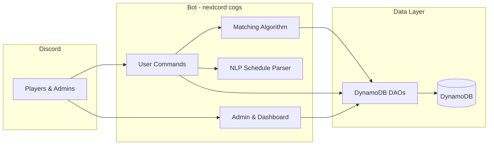

# Tennis Meetup Bot

A production Discord bot that automates tennis match scheduling, player matching, and court coordination for a 100+ member community—replacing manual group-chat coordination with structured slash-command workflows.

**Python · nextcord · AWS DynamoDB · Docker · Pytest**

---

## Impact

Before this bot, players coordinated matches through unstructured Discord messages: posting availability, negotiating skill level, and agreeing on courts by hand. The bot centralizes that into persistent profiles, natural-language scheduling, and ranked match suggestions—so organizers spend less time moderating logistics and players get faster, better-matched games.

---

## Engineering Highlights

| Area                 | What was built                                                                                                                                                                       |
| -------------------- | ------------------------------------------------------------------------------------------------------------------------------------------------------------------------------------ |
| **Matchmaking**      | Weighted compatibility scoring across NTRP skill, location, availability overlap, gender/skill preferences, engagement, and match history. Supports singles and doubles suggestions. |
| **Schedule parsing** | NLP pipeline for availability input (`"next Monday 4–6pm"`, recurrence, typos) with fuzzy correction via RapidFuzz and date parsing via dateparser.                                  |
| **Data layer**       | DynamoDB models and DAOs for players, schedules, matches, courts, and engagement—designed for server-scoped queries and horizontal scale on AWS.                                     |
| **Bot architecture** | Modular nextcord cogs (user commands, admin tools, dashboard) with a thin command wrapper and shared config/utilities for fast feature iteration.                                    |
| **Testing**          | Pytest suite with ~90% coverage on core business logic (matching, parser, models, DAOs), enforced via `pytest-cov` and `.coveragerc`.                                                |
| **Deployment**       | Dockerized bot + DynamoDB Local for dev; docker-compose stack deployable to EC2 with AWS DynamoDB in production.                                                                     |

---

## Tech Stack

| Layer    | Technologies                                                                                          |
| -------- | ----------------------------------------------------------------------------------------------------- |
| Bot      | [nextcord](https://github.com/nextcord/nextcord) 3.x (Discord API), slash commands, interactive views |
| Language | Python 3.13                                                                                           |
| Database | AWS DynamoDB (boto3), DynamoDB Local for development                                                  |
| Parsing  | dateparser, python-dateutil, RapidFuzz                                                                |
| Config   | YAML guild config, python-dotenv                                                                      |
| Testing  | Pytest, pytest-mock, pytest-cov, pytest-asyncio                                                       |
| Infra    | Docker, docker-compose                                                                                |

---

## Architecture



**`src/` layout (abridged)**

- `cogs/user/` — onboarding, profiles, scheduling, match discovery, match completion
- `cogs/admin/` — role/channel setup, court management, availability dashboard
- `utils/matching_algorithm.py` — multi-factor match scoring and suggestion ranking
- `cogs/user/commands/schedule/parser/` — natural-language time parsing
- `database/models/dynamodb/` + `database/dao/dynamodb/` — persistence layer

Slash commands cover profile setup, schedule management, match finding, match completion, and admin operations. See `src/cogs/user/commands/wrapper.py` for the command surface.

---

## Core Systems

### Player matching

`TennisMatchingAlgorithm` scores candidate pairs (or groups for doubles) using configurable weights: NTRP proximity, preference alignment, schedule overlap, engagement, and prior match quality. Results are ranked and returned as structured suggestions with court and time recommendations.

→ Deep dive: [docs/matching_algorithm.md](docs/matching_algorithm.md)

### Natural-language scheduling

Players add availability in plain English. The parser handles time ranges, relative dates, recurrence, and common typos, then validates duration and timezone before persisting to DynamoDB.

→ Integration notes: [docs/matching_integration.md](docs/matching_integration.md)

### Data model

| Entity             | Purpose                                              |
| ------------------ | ---------------------------------------------------- |
| **Player**         | NTRP rating, preferences, interests, engagement      |
| **Schedule**       | Availability windows with optional recurrence        |
| **Match**          | Scheduled/completed matches, scores, quality ratings |
| **Court**          | Location, surface, amenities                         |
| **UserEngagement** | Activity events for matchmaking weighting            |

---

## Testing

```bash
pip install -r requirements.txt
python -m pytest
```

Tests live under `tests/unit/` and target core logic (matching algorithm, NLP parser, DynamoDB models/DAOs, config). Discord UI layers are excluded from coverage thresholds. CI-ready: `pytest.ini` enforces `--cov-fail-under=90` on scoped modules via `.coveragerc`.

---

## Quick Start

**Prerequisites:** Python 3.13, Docker Desktop, AWS CLI (optional for prod)

1. **Install dependencies**

   ```bash
   pip install -r requirements.txt
   ```

2. **Configure environment** — create `.env` in the project root:

   ```
   DISCORD_TOKEN=your_discord_bot_token
   ENVIRONMENT=development
   DYNAMODB_ENDPOINT=http://localhost:8000
   ```

3. **Start DynamoDB Local**

   ```bash
   cd docker/dev && docker-compose up -d dynamodb-local
   ```

4. **Initialize tables and run**
   ```bash
   python -m src.database.init_db
   python main.py
   ```

Optional: `python scripts/seed_data.py` for sample players and courts.

---

## Deployment

The full stack (bot + DynamoDB) runs via docker-compose locally and on EC2. Production uses AWS DynamoDB; development uses DynamoDB Local in Docker.

→ AWS setup, table design, and EC2 workflow: [README-DYNAMODB.md](README-DYNAMODB.md)

---

## Documentation

| Doc                                                          | Contents                                                |
| ------------------------------------------------------------ | ------------------------------------------------------- |
| [docs/matching_algorithm.md](docs/matching_algorithm.md)     | Scoring weights, NTRP thresholds, singles/doubles logic |
| [docs/matching_integration.md](docs/matching_integration.md) | How scheduling feeds into matchmaking                   |
| [README-DYNAMODB.md](README-DYNAMODB.md)                     | DynamoDB config, deployment, operations                 |

---

## Author

Built and deployed for a live tennis community (100+ users). Designed for weekly feature updates with regression coverage on critical paths.
