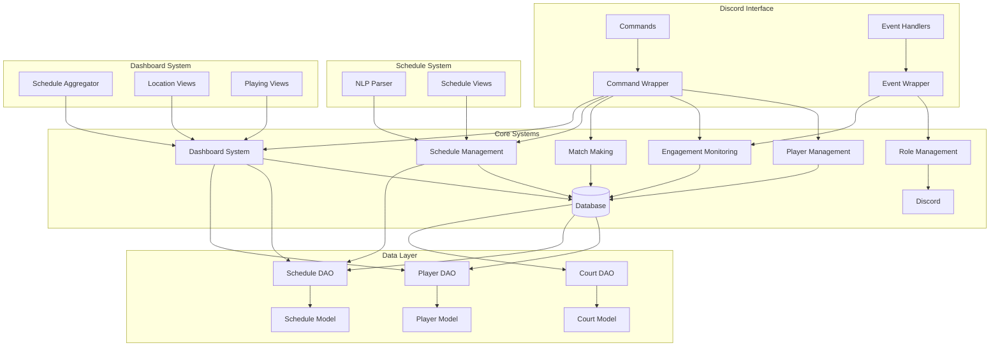

# System Patterns

## Architecture Overview



## Core Components

### Command System
- Uses Discord.py's Cog system for command organization
- Wrapper pattern for command handling and error management
- Step-based approach for multi-step commands
- Command groups with subcommands

### Schedule Management
- Natural language time parsing
  - Pattern matching priority system
  - Specific patterns before general ones
  - Comprehensive pattern validation
- Schedule data persistence
- Conflict detection
- Interactive views
- Period-based filtering

### Player Management
- Player profiles stored in DynamoDB
- DAO pattern for database interactions
- NTRP rating system implementation
- Location and availability tracking

### Engagement Monitoring
- Tracks match participation
- Monitors channel activity
- Calculates engagement scores
- Updates leaderboard data
- Availability dashboard for location-based player tracking

### Dashboard System
- Location-based availability aggregation
- Time slot organization (Morning/Afternoon/Evening)
- Currently playing view
- Admin commands for viewing and posting
- Interactive navigation between locations
- Schedule data processing by location and time

### Matchmaking System
- Learning algorithm for match recommendations
- Schedule compatibility checking
- Feedback collection and processing
- Continuous improvement based on match outcomes

### Role Management
- Automated role assignment based on activity
- Inactive role management
- Permission level handling
- Role-based access control

## Design Patterns

### Data Access
- DAO (Data Access Object) pattern for database operations
- Repository pattern for data management
- Model classes for data representation
- DynamoDB integration with AWS SDK

### Command Handling
- Command pattern for Discord interactions
- Step pattern for multi-stage commands
- Factory pattern for command creation
- Natural language parsing

### Event System
- Observer pattern for event handling
- Event-driven architecture for activity monitoring
- Pub/sub pattern for notifications

### View System
- Pagination pattern for list displays
- Confirmation dialogs for actions
- Interactive button interfaces
- Embed-based displays

## Code Organization

```
src/
├── cogs/
│   ├── admin/         # Administrative commands
│   │   ├── setup/     # Server setup commands
│   │   └── dashboard/ # Availability dashboard
│   │       ├── views/ # Dashboard UI components
│   │       └── ...    # Dashboard utilities
│   └── user/          # User-facing commands
│       └── commands/
│           ├── schedule/      # Schedule management
│           │   ├── parser/    # NLP parsing
│           │   ├── views/     # UI components
│           │   └── utils/     # Helpers
│           └── ...
├── config/            # Configuration management
├── database/          # Data access layer
│   ├── dao/          # Data Access Objects
│   │   └── dynamodb/ # DynamoDB-specific DAOs
│   └── models/       # Data models
│       └── dynamodb/ # DynamoDB-specific models
└── utils/            # Utility functions
```

## Key Technical Decisions

1. Database: DynamoDB
   - AWS-native integration
   - Scalable key-value store
   - Local development with DynamoDB Local
   - Flexible schema design
   - Global Secondary Indexes for efficient queries

2. Containerization: Docker
   - Consistent development environment
   - Easy deployment to AWS
   - Environment-specific configurations
   - Local development with Docker Compose

3. Command Structure
   - Modular Cog system
   - Natural language parsing
   - Subcommand grouping
   - Clear error handling

4. Schedule Management
   - NLP for time parsing
   - Conflict detection
   - Interactive views
   - Efficient querying

5. View System
   - Paginated displays
   - Interactive buttons
   - Confirmation dialogs
   - Clear formatting
   - Location-based navigation
   - Time-slot organization

## Implementation Guidelines

1. Error Handling
   - Comprehensive error catching
   - User-friendly error messages
   - Logging for debugging
   - Graceful failure recovery

2. Performance
   - Efficient database queries
   - Caching where appropriate
   - Asynchronous operations
   - Batch processing for updates

3. Security
   - Role-based access control
   - Input validation
   - Safe data handling
   - Secure configuration

4. Testing
   - Unit tests for core logic
   - Pattern-specific test files
   - Integration tests for commands
   - Mock testing for external services
   - Continuous testing pipeline
   - Pattern matching validation

5. Deployment
   - Docker containerization
   - AWS EC2 for hosting
   - DynamoDB for data storage
   - ECR for container registry
   - IAM roles for security
